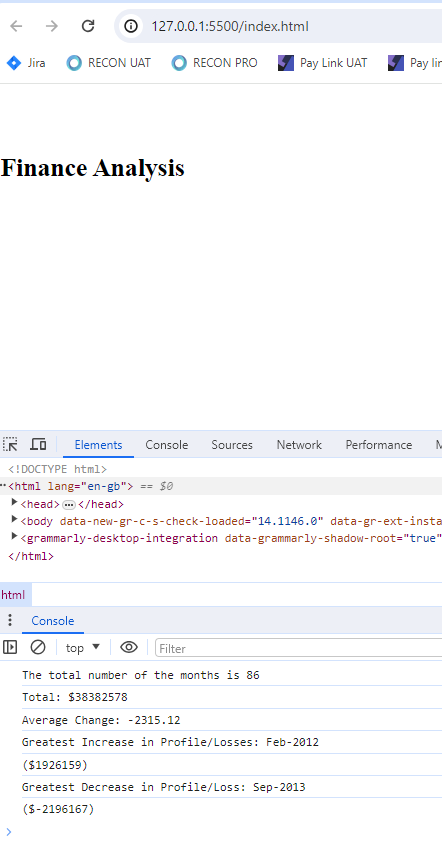

# Console-Finances

## Description 
 *creating code for analyzing the financial records of a company;
 *Showing the Financial Analysis result in Console:
  ----------------
  Total Months: 86
  Total: $38382578
  Average Change: -2315.12
  Greatest Increase in Profits/Losses: Feb-2012 ($1926159)
  Greatest Decrease in Profits/Losses: Sep-2013 ($-2196167)
  

## Installation

* using JavaScript;
* add different var for differentiating differenct financial figures;
* using "for loop" and if statement

## Usage 

* showed the result there.

## Credits

Very graceful to have below teammate and TA for working the codes together;
Thanks for @ Jamie Lujan, @Adebayo Adebisi
, 
@Dan Joyce
, 
@Dylan Gunda
, 
@Hardip Jandu
, 
@Jaimini Prajapati
, 

@roberts feldmanis
 and 
@Sing Lung Louie

## License

MIT licence
---

## Badges
N/A

## Features

* showed the result there.

## Contributing

N/A

## Tests

*tested all var and console logs.
